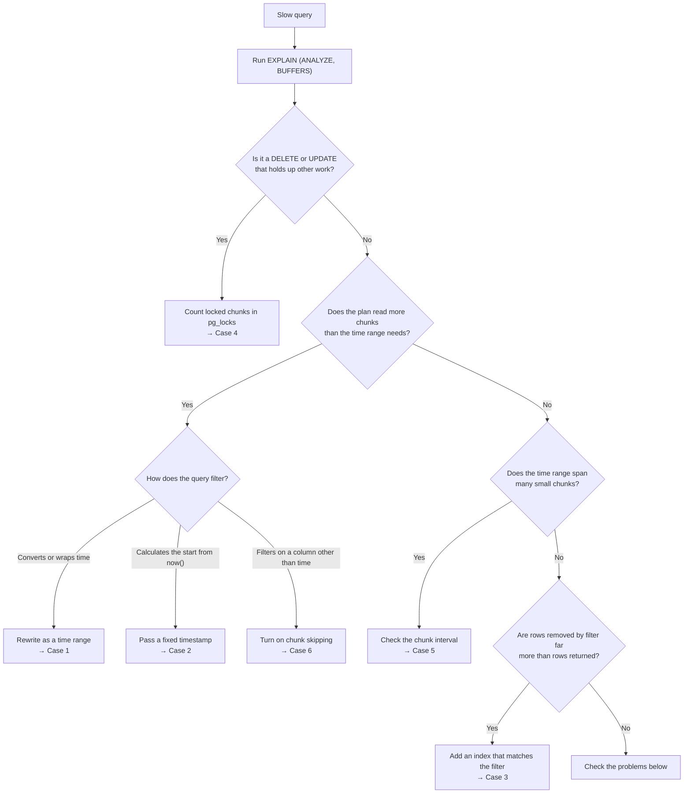

import { NumberedList, NumberedItem } from "@components/NumberedList";

This tutorial shows you how to find and fix slow queries on a hypertable through six case studies. It uses a sample manufacturing dataset that has hourly readings from ten sensors on each of five factory machines, over ten years, with about 4.4 million records in total.

If you want an overview of the settings that affect hypertable query speed first, see the guide [Improve hypertable and query performance](https://www.tigerdata.com/docs/build/performance-optimization/improve-hypertable-performance).

## What you learn

- How to identify and diagnose a slow hypertable query plan.
- How to read the parts of an `EXPLAIN (ANALYZE, BUFFERS)` plan that matter on a hypertable.
- How time filters, `now()`, indexes, chunk size, and chunk skipping affect query speed.
- Why a `DELETE` can lock every chunk in a hypertable, and how to limit the locks to the chunks it changes.

## Set up the data

<NumberedList>
<NumberedItem title="Create a Tiger Cloud service">

Create a Tiger Cloud service by following [our previous guide](https://www.tigerdata.com/docs/get-started/quickstart/create-service). Download the configuration file when you create it, and keep it for the next step. The file holds your connection string.

> **Note:** You can also follow this tutorial with a self-hosted TimescaleDB database instead.

</NumberedItem>
<NumberedItem title="Connect to your service">

Save your connection string in the `DATABASE_URL` environment variable and connect to your database with these commands:

```bash
export DATABASE_URL="<connection string>"
psql "$DATABASE_URL"
```

Initializing `DATABASE_URL` is required for the loading script in Step 4.

</NumberedItem>
<NumberedItem title="Create the hypertable">

Create the `sensor_data` hypertable by running this SQL in your `psql` session:

```sql
CREATE TABLE sensor_data (
    reading_id  bigint NOT NULL,
    time        timestamptz NOT NULL,
    device_id   text NOT NULL,
    tag         text NOT NULL,
    value       double precision,
    unit        text,
    description text
);

SELECT create_hypertable(
    'sensor_data',
    by_range('time', INTERVAL '7 days'),
    create_default_indexes => false
);

CREATE INDEX sensor_data_device_tag_time_idx
    ON sensor_data (device_id, tag, time DESC);
```

It creates the `sensor_data` table, converts it to a hypertable with [`create_hypertable()`](https://www.tigerdata.com/docs/reference/timescaledb/hypertables/create_hypertable) and adds an index for queries that filter on a machine, a sensor, and a time range.

The resulting hypertable stores each week of data in its own chunk, and leaves columnstore off, so no background job converts chunks while you work and every plan stays the same from case to case.

</NumberedItem>
<NumberedItem title="Load the manufacturing dataset">

Type `\q` to quit `psql`. Stay in the same terminal, so `DATABASE_URL` keeps its value, and download `manufacturing.zip`.

Unzip the dataset and install `psycopg`, the PostgreSQL driver for Python, by running these commands:

```bash
unzip manufacturing.zip
pip install "psycopg[binary]"
```

Save this script as `load_data.py` and run it in the same directory. It may take a minute or two, depending on your internet connection.

```python
"""
Load manufacturing.csv into the sensor_data hypertable.

The script numbers each reading in file order, which is time order,
and shifts every timestamp forward so the newest reading falls in
the current hour.
"""
import csv
import os
import sys
from datetime import datetime, timezone
from pathlib import Path

import psycopg

CSV_PATH = Path(__file__).resolve().parent / "manufacturing.csv"
COPY_SQL = """
    COPY sensor_data
        (reading_id, time, device_id, tag, value, unit, description)
    FROM STDIN
"""


def read_rows():
    with CSV_PATH.open(newline="", encoding="utf-8") as f:
        yield from csv.DictReader(f)


def main():
    url = os.environ.get("DATABASE_URL")
    if not url:
        sys.exit("Set DATABASE_URL to your service connection string.")
    if not CSV_PATH.exists():
        sys.exit(f"Can't find {CSV_PATH}. Unzip manufacturing.zip first.")

    print("Finding the newest reading in the file...")
    newest = max(datetime.fromisoformat(r["time"]) for r in read_rows())
    this_hour = datetime.now(timezone.utc).replace(
        minute=0, second=0, microsecond=0
    )
    shift = this_hour - newest
    print(f"Shifting timestamps forward by {shift.days} days.")

    with psycopg.connect(url) as conn:
        with conn.cursor() as cur:
            cur.execute("SELECT count(*) FROM sensor_data")
            if cur.fetchone()[0] > 0:
                sys.exit("sensor_data already has rows. Nothing loaded.")

            with cur.copy(COPY_SQL) as copy:
                for reading_id, r in enumerate(read_rows(), start=1):
                    copy.write_row((
                        reading_id,
                        datetime.fromisoformat(r["time"]) + shift,
                        r["device_id"],
                        r["tag"],
                        r["value"],
                        r["unit"],
                        r["description"],
                    ))
                    if reading_id % 500_000 == 0:
                        print(f"Sent {reading_id:,} rows...")

    print(f"Loaded {reading_id:,} rows into sensor_data.")


if __name__ == "__main__":
    main()
```

The loading script does three things:

- It reads the file once to find the newest reading, then shifts every timestamp forward by the same amount so the newest reading falls in the current hour. The shift makes queries about today and the past year return data.
- It numbers the readings in the order they appear in the file, which is time order, and stores the number in `reading_id`. Case 6 uses this column.
- It streams the rows into `sensor_data` with the PostgreSQL `COPY` command, which is much faster than inserting rows one at a time.

Verify the script loaded about 4.4 million rows into the table.

```
Finding the newest reading in the file...
Shifting timestamps forward by 34 days.
Sent 500,000 rows...
Sent 1,000,000 rows...
Sent 1,500,000 rows...
Sent 2,000,000 rows...
Sent 2,500,000 rows...
Sent 3,000,000 rows...
Sent 3,500,000 rows...
Sent 4,000,000 rows...
Loaded 4,380,050 rows into sensor_data.
```

</NumberedItem>
<NumberedItem title="Verify the data loaded correctly">

Reconnect to your database with `psql`. Update the planner statistics with `ANALYZE` and count the rows and chunks by running this SQL:

```sql
ANALYZE sensor_data;

SELECT count(*) AS readings,
        min(time) AS first_reading,
        max(time) AS last_reading
FROM sensor_data;

SELECT count(*) AS chunks FROM show_chunks('sensor_data');
```

Verify the output shows about 4.4 million readings, a time range of about ten years that ends in the current hour, and about one chunk for each week of data.

```
 readings |     first_reading      |      last_reading
----------+------------------------+------------------------
  4380050 | 2016-10-03 01:00:00+00 | 2026-10-01 01:00:00+00
(1 row)

 chunks
--------
    523
(1 row)
```

</NumberedItem>
<NumberedItem title="Save the time boundaries as psql variables">

Save the start of today, the start of yesterday and the date one year ago as `psql` variables by running this SQL. The `\gset` command stores each column of the result in a variable with the column's name.

```sql
SELECT date_trunc('day', now()) AS today_start,
       date_trunc('day', now()) - INTERVAL '1 day' AS yesterday_start,
       date_trunc('day', now()) - INTERVAL '1 year' AS year_ago
\gset
\echo :today_start :yesterday_start :year_ago
```

Verify the output shows three timestamps, starting with midnight today.

```
2026-10-01 00:00:00+00 2026-09-30 00:00:00+00 2025-10-01 00:00:00+00
```

When a query uses `:'today_start'`, `psql` replaces it with the saved value as a fixed timestamp before it sends the query. This works the same way as an application that calculates a timestamp in its own code and passes it to the query. Midnight in this tutorial means midnight in your session's time zone.

> **Note:** `psql` forgets these variables when you disconnect. If you reconnect during the tutorial, run this block again.

</NumberedItem>
</NumberedList>

## Read a query plan

A query plan is the report PostgreSQL gives of how it ran a query, and it shows where a slow hypertable query spends its time. In this section, you will learn to read the plan of a query that already runs fast. Each case later in the tutorial compares its slow plan with this one.

Run [`EXPLAIN (ANALYZE, BUFFERS)`](https://www.postgresql.org/docs/current/sql-explain.html) on a query that returns yesterday's vibration readings from `machine5`. The `ANALYZE` option runs the query and adds the real timings, and `BUFFERS` adds how much data the query read.

```sql
EXPLAIN (ANALYZE, BUFFERS)
SELECT time, value
FROM sensor_data
WHERE device_id = 'machine5'
  AND tag = 'vibration'
  AND time >= :'yesterday_start'
  AND time < :'today_start';
```

Example output:

```
 Bitmap Heap Scan on _hyper_25_784_chunk  (cost=2.65..37.42 rows=24 width=16) (actual time=0.062..0.081 rows=24.00 loops=1)
   Recheck Cond: ((device_id = 'machine5'::text) AND (tag = 'vibration'::text) AND ("time" >= '2026-09-30 00:00:00+00'::timestamp with time zone) AND ("time" < '2026-10-01 00:00:00+00'::timestamp with time zone))
   Heap Blocks: exact=16
   Buffers: shared hit=18
   ->  Bitmap Index Scan on _hyper_25_784_chunk_sensor_data_device_tag_time_idx  (cost=0.00..2.65 rows=24 width=0) (actual time=0.020..0.020 rows=24.00 loops=1)
         Index Cond: ((device_id = 'machine5'::text) AND (tag = 'vibration'::text) AND ("time" >= '2026-09-30 00:00:00+00'::timestamp with time zone) AND ("time" < '2026-10-01 00:00:00+00'::timestamp with time zone))
         Index Searches: 1
         Buffers: shared hit=2
 Planning:
   Buffers: shared hit=121
 Planning Time: 0.489 ms
 Execution Time: 0.101 ms
 Allocated Memory: allocated_by_plan=1083kB allocated_by_exec=206kB base_allocation=12975kB
(13 rows)
```

Find these parts in the plan.

- **Chunk lines.** Find the lines that name a chunk. Chunk names start with `_hyper_`. This plan has one chunk line, because yesterday's readings all sit in one weekly chunk.
- **The scan type.** Read the start of each chunk line to see how PostgreSQL found the rows. An index scan or a bitmap scan uses an index. A sequential scan reads every row in the chunk.
- **`Rows Removed by Filter`.** This line appears under a chunk line when PostgreSQL read rows and then discarded them because they didn't match the query. It doesn't appear in this plan because the index found only matching rows. You will see it first in Case 1.
- **The `Buffers` line.** Check how many blocks of data the query read. Each block is 8 kilobytes (KB). `shared hit` counts blocks found in memory, and `read` counts blocks read from disk.
- **`Planning Time` and `Execution Time`.** Compare these two lines at the bottom of the plan. They show how long PostgreSQL spent choosing the plan and running it.

Use these parts to judge a query plan. A healthy plan reads the chunks that hold the time range the query asks for, spends less time planning than executing, and removes minimal rows with a filter. An unhealthy plan diverges from these characteristics in some way. Each of the case studies in this tutorial features a different type of unhealthy query plan and shows how to fix it.

## Case 1: Fix a date filter that reads every chunk

### Symptom

You need yesterday's temperature readings from `machine3`. Your query converts `time` to a date and compares it with yesterday's date. It returns the correct rows and takes much longer than the one-day query in the previous section.

### Diagnosis

Run `EXPLAIN (ANALYZE, BUFFERS)` on the query.

```sql
EXPLAIN (ANALYZE, BUFFERS)
SELECT time, value
FROM sensor_data
WHERE device_id = 'machine3'
  AND tag = 'temperature'
  AND time::date = current_date - 1;
```

Compare your plan with this example, which is trimmed to the first chunk line. The full plan has a similar line for every chunk in the table.

```
Custom Scan (ChunkAppend) on sensor_data  (cost=2.98..59600.49 rows=523 width=16) (actual time=80.101..80.466 rows=24.00 loops=1)
  Chunks excluded during startup: 0
  Buffers: shared hit=59967
  ->  Bitmap Heap Scan on _hyper_28_8088_chunk  (cost=2.98..48.44 rows=1 width=16) (actual time=0.153..0.154 rows=0.00 loops=1)
        Recheck Cond: ((device_id = 'machine3'::text) AND (tag = 'temperature'::text))
        Filter: (("time")::date = (CURRENT_DATE - 1))
        Rows Removed by Filter: 70
        Heap Blocks: exact=47
        Buffers: shared hit=49
        ->  Bitmap Index Scan on _hyper_28_8088_chunk_sensor_data_device_tag_time_idx  (cost=0.00..2.98 rows=70 width=0) (actual time=0.034..0.034 rows=70.00 loops=1)
              Index Cond: ((device_id = 'machine3'::text) AND (tag = 'temperature'::text))
              Index Searches: 1
              Buffers: shared hit=2
  ...
Planning Time: 30.213 ms
Execution Time: 96.783 ms
```

Look for three problems in the plan.

- It has a chunk line for every chunk in the table, even though yesterday's readings sit in one chunk.
- Every chunk line has `Rows Removed by Filter` because PostgreSQL reads every temperature reading for `machine3` and discards the ones from other days.
- The buffer count is far higher than the plan in the previous section.

TimescaleDB skips a chunk by comparing the query's filter on `time` with the time range the chunk holds. The filter `time::date = current_date - 1` compares a value calculated from `time`, so TimescaleDB can't compare it with a chunk's range and has to include every chunk.

### Fix

Rewrite the filter as a range on `time`, from the start of yesterday up to the start of today, and run the query. Keep the time column by itself on one side of each comparison.

```sql
SELECT time, value
FROM sensor_data
WHERE device_id = 'machine3'
  AND tag = 'temperature'
  AND time >= :'yesterday_start'
  AND time < :'today_start';
```

### Confirm

Run `EXPLAIN (ANALYZE, BUFFERS)` on the rewritten query.

```sql
EXPLAIN (ANALYZE, BUFFERS)
SELECT time, value
FROM sensor_data
WHERE device_id = 'machine3'
  AND tag = 'temperature'
  AND time >= :'yesterday_start'
  AND time < :'today_start';
```

Verify your plan reads one chunk, with a much lower buffer count and a much shorter execution time.

```
Bitmap Heap Scan on _hyper_28_8609_chunk  (cost=2.65..37.42 rows=24 width=16) (actual time=0.023..0.041 rows=24.00 loops=1)
  Recheck Cond: ((device_id = 'machine3'::text) AND (tag = 'temperature'::text) AND ("time" >= '2026-09-30 00:00:00+00'::timestamp with time zone) AND ("time" < '2026-10-01 00:00:00+00'::timestamp with time zone))
  Heap Blocks: exact=16
  Buffers: shared hit=18
  ->  Bitmap Index Scan on _hyper_28_8609_chunk_sensor_data_device_tag_time_idx  (cost=0.00..2.65 rows=24 width=0) (actual time=0.012..0.012 rows=24.00 loops=1)
        Index Cond: ((device_id = 'machine3'::text) AND (tag = 'temperature'::text) AND ("time" >= '2026-09-30 00:00:00+00'::timestamp with time zone) AND ("time" < '2026-10-01 00:00:00+00'::timestamp with time zone))
        Index Searches: 1
        Buffers: shared hit=2
Planning:
  Buffers: shared hit=18
Planning Time: 0.236 ms
Execution Time: 0.057 ms
```

## Case 2: Fix a "today so far" query that plans every chunk

### Symptom

A dashboard panel shows power consumption for `machine1` since midnight, and it refreshes every few seconds. Its query calculates the start of the day from `now()`. The query returns minimal rows, and most of its time goes to planning.

### Diagnosis

Run `EXPLAIN (ANALYZE, BUFFERS)` on the dashboard query.

```sql
EXPLAIN (ANALYZE, BUFFERS)
SELECT time, value
FROM sensor_data
WHERE device_id = 'machine1'
  AND tag = 'power_consumption'
  AND time >= date_trunc('day', now());
```

Compare your plan with this example:

```
Custom Scan (ChunkAppend) on sensor_data  (cost=0.28..2255.69 rows=525 width=16) (actual time=0.036..0.038 rows=3.00 loops=1)
  Chunks excluded during startup: 522
  Buffers: shared hit=3
  ->  Bitmap Heap Scan on _hyper_28_8610_chunk  (cost=2.19..4.62 rows=3 width=16) (actual time=0.035..0.037 rows=3.00 loops=1)
        Recheck Cond: ((device_id = 'machine1'::text) AND (tag = 'power_consumption'::text) AND ("time" >= date_trunc('day'::text, now())))
        Heap Blocks: exact=2
        Buffers: shared hit=3
        ->  Bitmap Index Scan on _hyper_28_8610_chunk_sensor_data_device_tag_time_idx  (cost=0.00..2.19 rows=3 width=0) (actual time=0.017..0.017 rows=3.00 loops=1)
              Index Cond: ((device_id = 'machine1'::text) AND (tag = 'power_consumption'::text) AND ("time" >= date_trunc('day'::text, now())))
              Index Searches: 1
              Buffers: shared hit=1
Planning:
  Buffers: shared hit=4715
Planning Time: 21.514 ms
Execution Time: 4.483 ms
```

Find the `Chunks excluded during startup` line. It shows that TimescaleDB removed every other chunk when the query started running. Then compare `Planning Time` with `Execution Time`. Planning takes much longer.

The result of `date_trunc('day', now())` depends on the current time and the session's time zone, so PostgreSQL treats it as unknown until the query runs. The planner can't use it to skip chunks, so it plans every chunk in the table. TimescaleDB then removes the extra chunks when the query starts, after the planning work is done. A dashboard that runs this query on every refresh repeats that planning work each time.

> **Note:** TimescaleDB skips chunks during planning for the simpler form `time > now() - INTERVAL '1 day'`. Calculations such as `date_trunc()` on `now()` still wait until the query runs.

### Fix

Pass the start of the day as a fixed timestamp and run the query. In an application, calculate the timestamp in your own code and pass it to the query as a parameter.

```sql
SELECT time, value
FROM sensor_data
WHERE device_id = 'machine1'
  AND tag = 'power_consumption'
  AND time >= :'today_start';
```

### Confirm

Run `EXPLAIN (ANALYZE, BUFFERS)` on the rewritten query.

```sql
EXPLAIN (ANALYZE, BUFFERS)
SELECT time, value
FROM sensor_data
WHERE device_id = 'machine1'
  AND tag = 'power_consumption'
  AND time >= :'today_start';
```

Verify your plan has no `Chunks excluded during startup` line, reads one chunk and has a much shorter planning time.

```
Bitmap Heap Scan on _hyper_28_8610_chunk  (cost=2.18..4.59 rows=3 width=16) (actual time=0.018..0.019 rows=3.00 loops=1)
  Recheck Cond: ((device_id = 'machine1'::text) AND (tag = 'power_consumption'::text))
  Heap Blocks: exact=2
  Buffers: shared hit=3
  ->  Bitmap Index Scan on _hyper_28_8610_chunk_sensor_data_device_tag_time_idx  (cost=0.00..2.17 rows=3 width=0) (actual time=0.007..0.007 rows=3.00 loops=1)
        Index Cond: ((device_id = 'machine1'::text) AND (tag = 'power_consumption'::text))
        Index Searches: 1
        Buffers: shared hit=1
Planning:
  Buffers: shared hit=17
Planning Time: 0.212 ms
Execution Time: 0.035 ms
```

## Case 3: Fix a threshold query that scans every row

### Symptom

The maintenance team reviews every vibration reading above 18 millimeters per second (mm/s) from the past year, across all five machines. The query returns a few dozen rows and takes much longer than the single-machine queries in the earlier cases.

### Diagnosis

Run `EXPLAIN (ANALYZE, BUFFERS)` on the maintenance query.

```sql
EXPLAIN (ANALYZE, BUFFERS)
SELECT device_id, time, value
FROM sensor_data
WHERE tag = 'vibration'
  AND value > 18
  AND time >= :'year_ago';
```

Compare your plan with this example, which is trimmed to one chunk line from the middle of the plan.

```
Append  (cost=14.93..8387.14 rows=34369 width=25) (actual time=0.317..13.967 rows=70.00 loops=1)
  Buffers: shared hit=6746
  ->  Bitmap Heap Scan on _hyper_28_8558_chunk  (cost=30.17..155.77 rows=659 width=25) (actual time=0.187..0.280 rows=3.00 loops=1)
        Recheck Cond: (tag = 'vibration'::text)
        Filter: (value > '18'::double precision)
        Rows Removed by Filter: 837
        Heap Blocks: exact=112
        Buffers: shared hit=129
        ->  Bitmap Index Scan on _hyper_28_8558_chunk_sensor_data_device_tag_time_idx  (cost=0.00..30.01 rows=840 width=0) (actual time=0.095..0.095 rows=840.00 loops=1)
              Index Cond: (tag = 'vibration'::text)
              Index Searches: 6
              Buffers: shared hit=17
  ...
Planning Time: 1.443 ms
Execution Time: 14.710 ms
```

Check the chunk lines. The plan reads only the chunks from the past year, so the time filter works. Then compare `Rows Removed by Filter` on each chunk with the rows the chunk returns. The removed count is far larger.

The index on `device_id`, `tag` and `time` doesn't include `value`, so PostgreSQL can't use it to find readings above 18 mm/s. Depending on your PostgreSQL version, the plan shows a sequential scan that reads every row in each chunk, or a bitmap scan on the existing index that reads every vibration reading in each chunk. On PostgreSQL 18 and later, the `Index Searches` line shows that PostgreSQL searched the index several times, skipping from one machine to the next. Either way, PostgreSQL discards almost everything it reads.

### Fix

Create an index on `tag` and `value`, which matches how the maintenance query filters, and update the table statistics by running this SQL.

```sql
CREATE INDEX sensor_data_tag_value_idx
    ON sensor_data (tag, value);

ANALYZE sensor_data;
```

Every index adds work to each insert and takes storage. On the test service, this index added 191 megabytes (MB). Add indexes for queries your application runs often.

### Confirm

Run `EXPLAIN (ANALYZE, BUFFERS)` on the maintenance query again.

```sql
EXPLAIN (ANALYZE, BUFFERS)
SELECT device_id, time, value
FROM sensor_data
WHERE tag = 'vibration'
  AND value > 18
  AND time >= :'year_ago';
```

Verify that most chunk lines name `sensor_data_tag_value_idx`, the plan removes far fewer rows with a filter and the buffer count is much lower. This example plan is trimmed to one chunk line from the middle of the plan:

```
Append  (cost=14.93..7458.79 rows=34369 width=25) (actual time=0.162..1.772 rows=70.00 loops=1)
  Buffers: shared hit=100 read=104
  ->  Bitmap Heap Scan on _hyper_28_8558_chunk  (cost=15.04..137.92 rows=659 width=25) (actual time=0.046..0.048 rows=3.00 loops=1)
        Recheck Cond: ((tag = 'vibration'::text) AND (value > '18'::double precision))
        Heap Blocks: exact=3
        Buffers: shared hit=3 read=2
        ->  Bitmap Index Scan on _hyper_28_8558_chunk_sensor_data_tag_value_idx  (cost=0.00..14.88 rows=659 width=0) (actual time=0.028..0.028 rows=3.00 loops=1)
              Index Cond: ((tag = 'vibration'::text) AND (value > '18'::double precision))
              Index Searches: 1
              Buffers: shared read=2
  ...
Planning Time: 3.487 ms
Execution Time: 2.499 ms
```

The oldest and newest chunks can still show a different scan and a small `Rows Removed by Filter` count. The oldest chunk holds only part of the past year, and the newest chunk holds only a few hours of data, so the planner picks the scan that suits each one.

## Case 4: Fix a delete that locks every chunk

### Symptom

The pressure sensor on `machine2` recorded bad readings since midnight, and you need to delete them. The `DELETE` calculates the start of the day from `now()`, the same way as the dashboard query in Case 2. On a busy service, maintenance that needs a chunk this `DELETE` has locked waits until the `DELETE` finishes.

### Diagnosis

Run this SQL to delete the readings inside a transaction, count the chunks your session has locked with the [`pg_locks`](https://www.postgresql.org/docs/current/view-pg-locks.html) system view and roll the transaction back. The rollback keeps the data in place for the rest of the tutorial.

```sql
BEGIN;

DELETE FROM sensor_data
WHERE device_id = 'machine2'
  AND tag = 'pressure'
  AND time >= date_trunc('day', now());

SELECT count(DISTINCT l.relation) AS locked_chunks
FROM pg_locks AS l
JOIN pg_class AS c ON c.oid = l.relation
WHERE l.pid = pg_backend_pid()
  AND c.relkind = 'r'
  AND c.relname LIKE '_hyper%chunk';

ROLLBACK;
```

Check the output. It shows the number of rows deleted, then the number of chunks the transaction held locks on.

```
BEGIN
DELETE 3
 locked_chunks
---------------
           523
(1 row)

ROLLBACK
```

The `DELETE` locked every chunk in the table. PostgreSQL locks every chunk the planner includes, and the planner includes all of them when the start time is known only once the statement runs. Until the transaction ends, any work that needs a stronger lock on one of those chunks waits. That work includes creating an index, dropping chunks with a data retention policy and converting chunks to the columnstore. Each lock also takes space in the shared lock table, and a statement that locks thousands of chunks can fail with an `out of shared memory` error.

### Fix

Replace `date_trunc('day', now())` in the `DELETE` with `:'today_start'`, the start of the day as a fixed timestamp. Run the rewritten `DELETE` inside a transaction in the next step, so the rows stay in place.

### Confirm

Run this SQL to delete the readings with the rewritten `DELETE` inside a transaction, count the locked chunks again and roll back.

```sql
BEGIN;

DELETE FROM sensor_data
WHERE device_id = 'machine2'
  AND tag = 'pressure'
  AND time >= :'today_start';

SELECT count(DISTINCT l.relation) AS locked_chunks
FROM pg_locks AS l
JOIN pg_class AS c ON c.oid = l.relation
WHERE l.pid = pg_backend_pid()
  AND c.relkind = 'r'
  AND c.relname LIKE '_hyper%chunk';

ROLLBACK;
```

Verify the output shows the same number of deleted rows and a lock on only one chunk, the chunk that holds today's data.

```
BEGIN
DELETE 3
 locked_chunks
---------------
             1
(1 row)

ROLLBACK
```

To remove whole time ranges of old data, drop entire chunks with [`drop_chunks()`](https://www.tigerdata.com/docs/reference/timescaledb/hypertables/drop_chunks) or a data retention policy, which is much faster than a `DELETE`.

## Case 5: Fix a chunk interval that creates too many chunks

### Symptom

A dashboard chart shows the daily maximum temperature of `machine1` for the past year. The chart runs slower on a copy of the table that stores each day in its own chunk.

Create `sensor_data_daily`, a copy of `sensor_data` with a one-day chunk interval and the same indexes, by running this SQL.

```sql
CREATE TABLE sensor_data_daily (LIKE sensor_data INCLUDING ALL);

SELECT create_hypertable(
    'sensor_data_daily',
    by_range('time', INTERVAL '1 day'),
    create_default_indexes => false
);
```

Copy the data into `sensor_data_daily` in batches of 90 days and update the table statistics by running this SQL. Each batch commits separately, which keeps the number of chunk locks in each transaction low. The copy takes a minute or two.

```sql
DO $$
DECLARE
    batch_start timestamptz := (SELECT min(time) FROM sensor_data);
BEGIN
    WHILE batch_start <= (SELECT max(time) FROM sensor_data) LOOP
        INSERT INTO sensor_data_daily
        SELECT * FROM sensor_data
        WHERE time >= batch_start
          AND time < batch_start + INTERVAL '90 days';
        COMMIT;
        batch_start := batch_start + INTERVAL '90 days';
    END LOOP;
END
$$;

ANALYZE sensor_data_daily;
```

### Diagnosis

Count the chunks in each table by running this SQL.

```sql
SELECT hypertable_name, num_chunks
FROM timescaledb_information.hypertables
WHERE hypertable_name LIKE 'sensor_data%'
ORDER BY hypertable_name;
```

Check that `sensor_data_daily` has about seven times as many chunks as `sensor_data`.

```
  hypertable_name  | num_chunks
-------------------+------------
 sensor_data       |        523
 sensor_data_daily |       3651
(2 rows)
```

Run `EXPLAIN (ANALYZE, BUFFERS)` on the chart query against `sensor_data_daily`.

```sql
EXPLAIN (ANALYZE, BUFFERS)
SELECT time_bucket('1 day', time) AS day,
       max(value) AS max_temperature
FROM sensor_data_daily
WHERE device_id = 'machine1'
  AND tag = 'temperature'
  AND time >= :'year_ago'
  AND time < :'today_start'
GROUP BY day
ORDER BY day;
```

Compare your plan with this example, which is trimmed to the first chunk line. The full plan has a line for each day of the past year.

```
Sort  (cost=7678.64..7698.98 rows=8136 width=16) (actual time=21.920..22.313 rows=365.00 loops=1)
  Sort Key: (time_bucket('1 day'::interval, sensor_data_daily."time"))
  Sort Method: quicksort  Memory: 36kB
  Buffers: shared hit=6570
  ->  Finalize HashAggregate  (cost=7048.50..7150.20 rows=8136 width=16) (actual time=21.761..22.221 rows=365.00 loops=1)
        Group Key: (time_bucket('1 day'::interval, sensor_data_daily."time"))
        Batches: 1  Memory Usage: 297kB
        Buffers: shared hit=6570
        ->  Append  (cost=18.97..7021.12 rows=5475 width=16) (actual time=0.122..21.981 rows=365.00 loops=1)
              Buffers: shared hit=6570
              ->  Partial HashAggregate  (cost=18.97..19.16 rows=15 width=16) (actual time=0.121..0.124 rows=1.00 loops=1)
                    Group Key: time_bucket('1 day'::interval, _hyper_29_11896_chunk."time")
                    Batches: 1  Memory Usage: 32kB
                    Buffers: shared hit=18
                    ->  Bitmap Heap Scan on _hyper_29_11896_chunk  (cost=2.52..18.85 rows=24 width=16) (actual time=0.087..0.112 rows=24.00 loops=1)
                          Recheck Cond: ((device_id = 'machine1'::text) AND (tag = 'temperature'::text))
                          Heap Blocks: exact=16
                          Buffers: shared hit=18
                          ->  Bitmap Index Scan on _hyper_29_11896_chunk_sensor_data_daily_device_id_tag_time_idx  (cost=0.00..2.52 rows=24 width=0) (actual time=0.024..0.024 rows=24.00 loops=1)
                                Index Cond: ((device_id = 'machine1'::text) AND (tag = 'temperature'::text))
                                Index Searches: 1
                                Buffers: shared hit=2
              ...
Planning Time: 32.485 ms
Execution Time: 41.773 ms
```

The query reads one chunk for each day in the past year. The planner checks every chunk it includes, and every chunk adds its own scan to the plan, so the same year of data costs more planning and execution time when it's split into more chunks.

### Fix

Choose a chunk interval so the indexes of the chunks currently receiving data fit in about 25% of your service's memory. The [chunk sizing guide](https://www.tigerdata.com/docs/learn/hypertables/sizing-hypertable-chunks) explains the guideline. That guideline sets the largest useful interval. Below it, fewer chunks mean less planning work for queries that cover a long time range.

Check the index size of the most recent full week in `sensor_data` by running this SQL. The query skips the newest chunk, which is still filling with data.

```sql
SELECT c.chunk_name,
       pg_size_pretty(d.index_bytes) AS index_size
FROM timescaledb_information.chunks AS c
JOIN chunks_detailed_size('sensor_data') AS d USING (chunk_name)
WHERE c.hypertable_name = 'sensor_data'
ORDER BY c.range_end DESC
OFFSET 1
LIMIT 1;
```

Verify that a week of data needs only a small amount of index space, well within the guideline even on a small service.

```
      chunk_name       | index_size
-----------------------+------------
 _hyper_30_12783_chunk | 904 kB
(1 row)
```

This dataset adds minimal rows each week, so the seven-day interval of `sensor_data` fits the guideline with room to spare. Changing the interval of an existing hypertable with [`set_chunk_time_interval()`](https://www.tigerdata.com/docs/reference/timescaledb/hypertables/set_chunk_time_interval) affects only chunks created afterward. To change the interval of existing data, copy it into a table created with the new interval, the way you created `sensor_data_daily`.

### Confirm

Run `EXPLAIN (ANALYZE, BUFFERS)` on the chart query against `sensor_data`, which has weekly chunks.

```sql
EXPLAIN (ANALYZE, BUFFERS)
SELECT time_bucket('1 day', time) AS day,
       max(value) AS max_temperature
FROM sensor_data
WHERE device_id = 'machine1'
  AND tag = 'temperature'
  AND time >= :'year_ago'
  AND time < :'today_start'
GROUP BY day
ORDER BY day;
```

Verify your plan reads one chunk for each week and has a much shorter planning time than the plan on `sensor_data_daily`.

```
Sort  (cost=6715.38..6735.67 rows=8116 width=16) (actual time=10.071..10.144 rows=365.00 loops=1)
  Sort Key: (time_bucket('1 day'::interval, sensor_data."time"))
  Sort Method: quicksort  Memory: 36kB
  Buffers: shared hit=5998
  ->  Finalize HashAggregate  (cost=6086.93..6188.38 rows=8116 width=16) (actual time=9.890..10.054 rows=365.00 loops=1)
        Group Key: (time_bucket('1 day'::interval, sensor_data."time"))
        Batches: 1  Memory Usage: 297kB
        Buffers: shared hit=5998
        ->  Append  (cost=37.60..6059.00 rows=5586 width=16) (actual time=0.078..9.830 rows=365.00 loops=1)
              Buffers: shared hit=5998
              ->  Partial HashAggregate  (cost=37.60..37.88 rows=22 width=16) (actual time=0.078..0.080 rows=1.00 loops=1)
                    Group Key: time_bucket('1 day'::interval, _hyper_28_8557_chunk."time")
                    Batches: 1  Memory Usage: 32kB
                    Buffers: shared hit=18
                    ->  Bitmap Heap Scan on _hyper_28_8557_chunk  (cost=2.65..37.48 rows=24 width=16) (actual time=0.043..0.067 rows=24.00 loops=1)
                          Recheck Cond: ((device_id = 'machine1'::text) AND (tag = 'temperature'::text) AND ("time" >= '2025-10-01 00:00:00+00'::timestamp with time zone) AND ("time" < '2026-10-01 00:00:00+00'::timestamp with time zone))
                          Heap Blocks: exact=16
                          Buffers: shared hit=18
                          ->  Bitmap Index Scan on _hyper_28_8557_chunk_sensor_data_device_tag_time_idx  (cost=0.00..2.65 rows=24 width=0) (actual time=0.021..0.021 rows=24.00 loops=1)
                                Index Cond: ((device_id = 'machine1'::text) AND (tag = 'temperature'::text) AND ("time" >= '2025-10-01 00:00:00+00'::timestamp with time zone) AND ("time" < '2026-10-01 00:00:00+00'::timestamp with time zone))
                                Index Searches: 1
                                Buffers: shared hit=2
              ...
Planning Time: 4.042 ms
Execution Time: 12.549 ms
```

Drop `sensor_data_daily` by running this SQL. It drops the chunks in batches of 90 days first, because dropping thousands of chunks in one transaction can fail with an `out of shared memory` error.

```sql
DO $$
DECLARE
    cutoff timestamptz := (
        SELECT min(range_start) + INTERVAL '90 days'
        FROM timescaledb_information.chunks
        WHERE hypertable_name = 'sensor_data_daily'
    );
BEGIN
    WHILE cutoff < now() LOOP
        PERFORM drop_chunks('sensor_data_daily', older_than => cutoff);
        COMMIT;
        cutoff := cutoff + INTERVAL '90 days';
    END LOOP;
END
$$;

DROP TABLE sensor_data_daily;
```

## Case 6: Skip chunks when filtering on a second column

### Symptom

A quality system reports that readings 4,000,001 through 4,010,000 failed validation, and you query those readings by `reading_id`. The query takes a long time, even though the matching readings all come from about a week of data.

### Diagnosis

Run `EXPLAIN (ANALYZE, BUFFERS)` on the query.

```sql
EXPLAIN (ANALYZE, BUFFERS)
SELECT time, device_id, tag, value
FROM sensor_data
WHERE reading_id BETWEEN 4000001 AND 4010000;
```

Compare your plan with this example, which is trimmed to the first chunk line.

```
Gather  (cost=1000.00..99634.91 rows=10519 width=39) (actual time=36.563..115.904 rows=10000.00 loops=1)
  Workers Planned: 4
  Workers Launched: 4
  Buffers: shared hit=58923
  ->  Parallel Append  (cost=0.00..97583.01 rows=2501 width=39) (actual time=39.322..50.645 rows=2000.00 loops=5)
        Buffers: shared hit=58923
        ->  Parallel Seq Scan on _hyper_28_8089_chunk  (cost=0.00..187.12 rows=1 width=39) (actual time=1.008..1.009 rows=0.00 loops=1)
              Filter: ((reading_id >= 4000001) AND (reading_id <= 4010000))
              Rows Removed by Filter: 8400
              Buffers: shared hit=113
        ...
Planning Time: 60.147 ms
Execution Time: 123.333 ms
```

Check the chunk lines. The plan has a chunk line for every chunk in the table, and each one removes almost every row with a filter. TimescaleDB records the time range of each chunk. It has no record of which reading identifiers (IDs) each chunk holds, so it has to read every chunk.

### Fix

[Chunk skipping](https://www.tigerdata.com/docs/reference/timescaledb/hypertables/enable_chunk_skipping) tells TimescaleDB to record the lowest and highest value of a column in each chunk, and to skip chunks whose range doesn't match the query. TimescaleDB records these ranges when it converts a chunk to the [columnstore](https://www.tigerdata.com/docs/learn/columnar-storage/understand-hypercore). Chunk skipping helps on columns whose values rise over time, such as `reading_id`. A column such as `device_id` gains nothing, because every chunk holds every machine.

Turn on chunk skipping for your session and for the `reading_id` column by running this SQL.

```sql
SET timescaledb.enable_chunk_skipping = on;

SELECT enable_chunk_skipping('sensor_data', 'reading_id');
```

> **Note:** The `timescaledb.enable_chunk_skipping` setting applies to the current session. If you reconnect, run the `SET` statement again before you run the query in the next step.

Turn on the columnstore for `sensor_data` by running this SQL. It groups rows by machine and sensor, and sorts them by time within each group.

```sql
ALTER TABLE sensor_data SET (
    timescaledb.enable_columnstore = true,
    timescaledb.segmentby = 'device_id, tag',
    timescaledb.orderby = 'time DESC'
);
```

Convert every chunk to the columnstore with [`convert_to_columnstore()`](https://www.tigerdata.com/docs/reference/timescaledb/hypercore/convert_to_columnstore) by running this SQL. The conversion records the range of `reading_id` in each chunk and takes a minute or two.

```sql
DO $$
DECLARE
    chunk regclass;
BEGIN
    FOR chunk IN SELECT c FROM show_chunks('sensor_data') AS c LOOP
        CALL convert_to_columnstore(chunk);
    END LOOP;
END
$$;
```

In an application, add a columnstore policy to convert chunks automatically as they age. This tutorial converts them in one step so you can see the result right away.

### Confirm

Run `EXPLAIN (ANALYZE, BUFFERS)` on the query again.

```sql
EXPLAIN (ANALYZE, BUFFERS)
SELECT time, device_id, tag, value
FROM sensor_data
WHERE reading_id BETWEEN 4000001 AND 4010000;
```

Verify your plan reads only the chunks whose recorded range includes the reading IDs in the query. The chunk lines show a columnstore scan, because the chunks are now in the columnstore.

```
Append  (cost=10.05..12520.32 rows=832000 width=39) (actual time=0.028..1.800 rows=10000.00 loops=1)
  Buffers: shared hit=32
  ->  Custom Scan (ColumnarScan) on _hyper_28_8564_chunk  (cost=10.05..4180.16 rows=416000 width=39) (actual time=0.027..0.327 rows=1900.00 loops=1)
        Vectorized Filter: ((reading_id >= 4000001) AND (reading_id <= 4010000))
        Rows Removed by Filter: 6500
        Buffers: shared hit=16
        ->  Seq Scan on _hyper_28_8564_chunk_compressed  (cost=0.00..20.16 rows=416 width=180) (actual time=0.007..0.026 rows=50.00 loops=1)
              Buffers: shared hit=16
  ->  Custom Scan (ColumnarScan) on _hyper_28_8565_chunk  (cost=10.05..4180.16 rows=416000 width=39) (actual time=0.010..0.726 rows=8100.00 loops=1)
        Vectorized Filter: ((reading_id >= 4000001) AND (reading_id <= 4010000))
        Rows Removed by Filter: 300
        Buffers: shared hit=16
        ->  Seq Scan on _hyper_28_8565_chunk_compressed  (cost=0.00..20.16 rows=416 width=180) (actual time=0.006..0.022 rows=50.00 loops=1)
              Buffers: shared hit=16
Planning:
  Buffers: shared hit=2656
Planning Time: 2.597 ms
Execution Time: 2.220 ms
```

> **Note:** An index on `reading_id` also finds these rows. The planner still includes every chunk and searches each chunk's index. Chunk skipping removes the other chunks from the plan before it reads anything.

## Troubleshooting and decision tree

Use this flowchart to troubleshoot a slow hypertable query. Each endpoint names the case in this tutorial that covers the fix.



Or follow this checklist, which uses the same order.

<NumberedList>

<NumberedItem title="Run the plan">

Run `EXPLAIN (ANALYZE, BUFFERS)` on the slow query.

</NumberedItem>

<NumberedItem title="Check for locked chunks">

If a `DELETE` or `UPDATE` holds up other work, count the chunks it locks in `pg_locks`. See Case 4.

</NumberedItem>

<NumberedItem title="Check how the query filters">

If the plan reads more chunks than the time range needs, check how the query filters.

- The filter converts or wraps `time`. See Case 1.
- The filter calculates its start from `now()`, and the plan shows `Chunks excluded during startup`. See Case 2.
- The filter uses a column other than `time`. See Case 6.

</NumberedItem>

<NumberedItem title="Check the chunk interval">

If the time range spans many small chunks and planning time is high, check the chunk interval. See Case 5.

</NumberedItem>

<NumberedItem title="Check the filter against your indexes">

If `Rows Removed by Filter` is far larger than the rows the query returns, add an index that matches the filter. See Case 3.

</NumberedItem>

</NumberedList>

These problems can also come up while you follow the tutorial:

- **The loading script reports that `sensor_data` already has rows.** An earlier load finished or stopped partway. Run `TRUNCATE sensor_data;` in `psql`, then run the script again.
- **A query fails with a syntax error at or near `:`.** The `psql` variables from [Set up the data](#set-up-the-data) are missing, usually after a reconnect. Run the `\gset` block again.
- **`enable_chunk_skipping()` fails with `chunk skipping functionality disabled`.** Run `SET timescaledb.enable_chunk_skipping = on;` in the same session first.
- **A statement fails with `out of shared memory`.** The statement locks more chunks than the shared lock table holds. Split the work into batches that commit separately, as the copy and drop steps in Case 5 do.
- **A plan shows a columnstore scan before Case 6.** A columnstore policy converted chunks in the background, which happens when you create the table with `CREATE TABLE ... WITH (tsdb.hypertable)`. Drop the table and create it again with the SQL in [Set up the data](#set-up-the-data).
- **A plan shows a different scan type from the tutorial.** Run `ANALYZE sensor_data;` and run the plan again. PostgreSQL versions and service sizes can choose different scan types. The chunk lines, `Rows Removed by Filter` and the timings show the same problem in either case.

## Recap

You learned how to read a hypertable query plan and to fix six common causes of slow hypertable queries. Use this table to recognize the six slow patterns in a plan.

| Case | Pattern | What the query plan shows | Fix |
|---|---|---|---|
| 1 | Date filter on a converted `time` | A line for every chunk, with rows removed by the filter | Filter on a range of `time` |
| 2 | Start of day calculated from `now()` | `Chunks excluded during startup`, planning time longer than execution time | Pass a fixed timestamp |
| 3 | Threshold filter the index can't use | A large `Rows Removed by Filter` on every chunk | Add an index that matches the filter |
| 4 | `DELETE` with a start time calculated from `now()` | A lock on every chunk in `pg_locks` | Pass a fixed timestamp |
| 5 | Chunk interval too small | Many chunk lines for a long time range, high planning time | Size the interval to memory and to the queries |
| 6 | Filter on a column other than `time` | A line for every chunk | Turn on chunk skipping and use the columnstore |

These measurements were collected from a test Tiger Cloud service with 8 CPUs and 32 GiB of memory, running PostgreSQL 18.6 and TimescaleDB 2.29.2. Times are in milliseconds, and buffers count 8 KB blocks read from memory and disk.

| Case | Measurement | Before | After | Change |
|---|---|---|---|---|
| 1 | Execution time | 97 | 0.06 | 1,698 times shorter |
| 1 | Buffers | 59,967 | 18 | 3,332 times fewer |
| 2 | Planning time | 22 | 0.21 | 101 times shorter |
| 3 | Execution time | 15 | 2.5 | 5.9 times shorter |
| 3 | Buffers | 6,746 | 204 | 33 times fewer |
| 4 | Chunks locked | 523 | 1 | 523 times fewer |
| 5 | Chunks read | 365 | 53 | 6.9 times fewer |
| 5 | Planning time | 32 | 4.0 | 8.0 times shorter |
| 6 | Chunks read | 523 | 2 | 262 times fewer |
| 6 | Execution time | 123 | 2.2 | 56 times shorter |

The "today so far" query in Case 2 shows why this matters for a dashboard. Before the fix, it spent 22 ms planning every chunk in the table before it read one chunk. A dashboard panel that runs the query on every refresh repeats that planning work each time, for every viewer.

For your next step, run `EXPLAIN (ANALYZE, BUFFERS)` on the slowest query in your own application and check it against the [decision tree](#troubleshooting-and-decision-tree).

### Learn more

- [Using `EXPLAIN`](https://www.postgresql.org/docs/current/using-explain.html) in the PostgreSQL documentation
- [Improve hypertable and query performance](https://www.tigerdata.com/docs/build/performance-optimization/improve-hypertable-performance)
- [Hypertable indexes](https://www.tigerdata.com/docs/learn/hypertables/hypertable-indexes)
- [Sizing hypertable chunks](https://www.tigerdata.com/docs/learn/hypertables/sizing-hypertable-chunks)
- [Understand hypercore](https://www.tigerdata.com/docs/learn/columnar-storage/understand-hypercore), the columnstore in TimescaleDB
- [`enable_chunk_skipping()`](https://www.tigerdata.com/docs/reference/timescaledb/hypertables/enable_chunk_skipping)
- [Understand data retention](https://www.tigerdata.com/docs/learn/data-lifecycle/data-retention/about-data-retention)
- [Explicit locking](https://www.postgresql.org/docs/current/explicit-locking.html) in the PostgreSQL documentation, which lists the lock modes and the statements they block