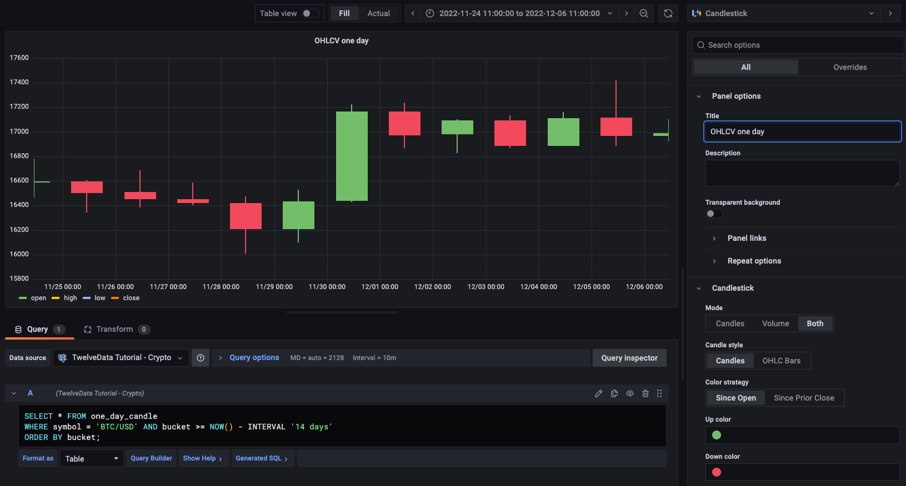

import * as C from "@constants";
import { Steps, Step } from "@stainless-api/docs/components";

## Graph OHLCV data

When you have extracted the raw OHLCV data, you can use it to graph the result
in a candlestick chart, using Grafana. To do this, you need to have Grafana set
up to connect to your {C.SELF_LONG} instance.

### Graphing OHLCV data

<Steps>

<Step title="Ensure you have Grafana installed, and you are using the TimescaleDB">

database that contains the Twelve Data dataset set up as a
data source.

</Step>

<Step title="In Grafana, from the `Dashboards` menu, click `New Dashboard`. In the">

`New Dashboard` page, click `Add a new panel`.

</Step>

<Step title="In the `Visualizations` menu in the top right corner, select `Candlestick`">

from the list. Ensure you have set the Twelve Data dataset as
your data source.

</Step>

<Step title="Click `Edit SQL` and paste in the query you used to get the OHLCV values." />

<Step title="In the `Format as` section, select `Table`." />

<Step title="Adjust elements of the table as required, and click `Apply` to save your">

graph to the dashboard.

</Step>

</Steps>
