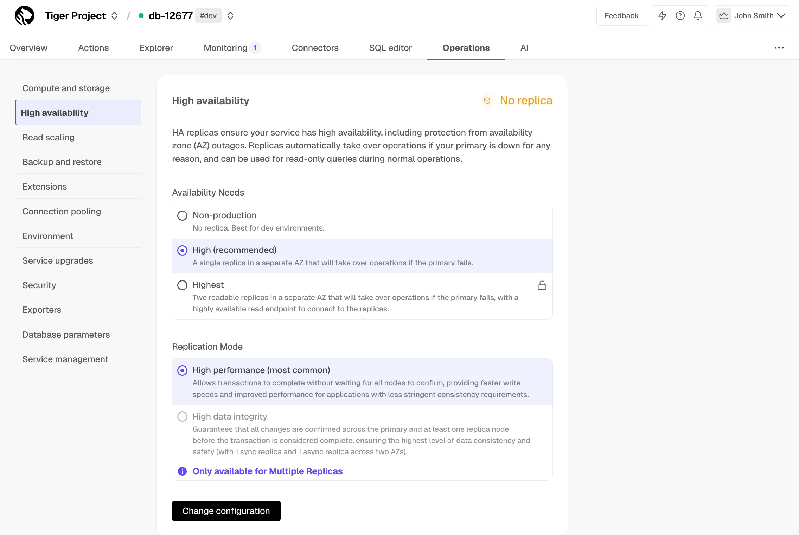

import * as C from "@constants";
import { NumberedList, NumberedItem } from "@components/NumberedList";

<NumberedList>

<NumberedItem title={`In ${C.CONSOLE_LONG}, select the ${C.SERVICE_SHORT} to enable replication for.`}></NumberedItem>

<NumberedItem title="Click `Operations`, then select `High availability`."></NumberedItem>

<NumberedItem title="Choose your replication strategy, then click `Change configuration`.">

</NumberedItem>

<NumberedItem title="In `Change high availability configuration`, click `Change config`."></NumberedItem>

</NumberedList>
