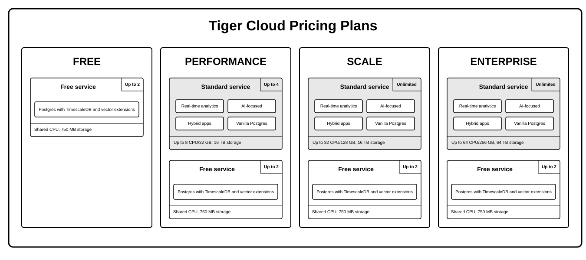

import * as C from "@constants";

import FreeBeta from "./_free-plan-beta.mdx";

A {C.SERVICE_LONG} is a single optimized {C.PG} instance extended with innovations in the database engine and cloud
infrastructure to deliver speed without sacrifice. A {C.SERVICE_LONG} is 10-1000x faster at scale! It
is ideal for applications requiring strong data consistency, complex relationships, and advanced querying capabilities.
Get ACID compliance, extensive SQL support, JSON handling, and extensibility through custom functions, data types, and
extensions.

Each {C.SERVICE_SHORT} is associated with a project in {C.CLOUD_LONG}. Each project can have multiple {C.SERVICE_SHORT}s. Each user is a [member of one or more projects](/use-timescale/security/members/).

You create free and standard {C.SERVICE_SHORT}s in {C.CONSOLE_LONG}, depending on your [{C.PRICING_PLAN}](/about/pricing-and-account-management/). A free {C.SERVICE_SHORT} comes at zero cost and gives you limited resources to get to know {C.CLOUD_LONG}. Once you are ready to try out more advanced features, you can switch to a paid plan and convert your free {C.SERVICE_SHORT} to a standard one.

<FreeBeta />

To the {C.PG} you know and love, {C.CLOUD_LONG} adds the following capabilities:

- **Standard {C.SERVICE_SHORT}s**:

    - _Real-time analytics_: store and query [time-series data](https://www.tigerdata.com/blog/time-series-database-an-explainer#what-is-a-time-series-database) at scale for
      real-time analytics and other use cases. Get faster time-based queries with {C.HYPERTABLE}s, {C.CAGG}s, and columnar storage. Save money by compressing data into the {C.COLUMNSTORE}, moving cold data to low-cost bottomless storage in Amazon S3 or Azure Blob storage, and deleting old data with automated policies.
    - _AI-focused_: build AI applications from start to scale. Get fast and accurate similarity search
      with the pgvector and pgvectorscale extensions.
    - _Hybrid applications_: get a full set of tools to develop applications that combine time-based data and AI.

  All standard {C.SERVICE_LONG}s include the tooling you expect for production and developer environments: [live migration](/migrate/live-migration/),
  [automatic backups and PITR](/use-timescale/backup-restore/), [high availability](/use-timescale/ha-replicas/high-availability/), [{C.READ_REPLICA}s](/use-timescale/ha-replicas/read-scaling/), [data forking](/use-timescale/services/service-management/#fork-a-service), [connection pooling](/use-timescale/services/connection-pooling), [tiered storage](/use-timescale/data-tiering/),
  [usage-based storage](/about/pricing-and-account-management/#how-your-bill-is-calculated), secure in-{C.CONSOLE} [SQL editing](/getting-started/run-queries-from-console/), {C.SERVICE_SHORT} [metrics](/use-timescale/metrics-logging/monitoring/#metrics)
  and [insights](/use-timescale/metrics-logging/monitoring/#insights),&nbsp;[streamlined maintenance](/use-timescale/upgrades/),&nbsp;and much more. {C.CLOUD_LONG} continuously monitors your {C.SERVICE_SHORT}s and prevents common {C.PG} out-of-memory crashes.

- **Free {C.SERVICE_SHORT}s**:

  _{C.PG} with {C.TIMESCALE_DB} and vector extensions_

  Free {C.SERVICE_SHORT}s offer limited resources and a basic feature scope, perfect to get to know {C.CLOUD_LONG} in a development environment.

You can [manage, pause, or delete](/use-timescale/services/) your {C.SERVICE_SHORT} at any time from {C.CONSOLE}.
